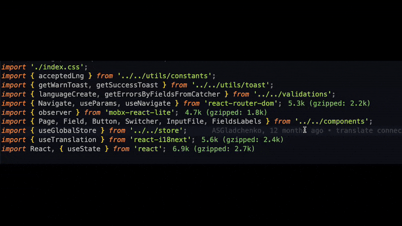

# Sort Imports & Styles

<p align="center">
  
</p>

Automatically sorts JavaScript/TypeScript imports and CSS/SCSS/SASS/LESS style properties with smart grouping, configurable ordering, and safe recursive style sorting.

## What It Does

For JavaScript and TypeScript, the extension rewrites the top import section of a file into a predictable layout:

- Groups imports by category
- Sorts each group by `length` or `alphabetical`
- Merges compatible duplicate imports from the same source
- Sorts named imports inside `{ ... }`
- Keeps standalone comments on their original lines and uses them as safe boundaries between sortable import segments
- Supports `import type`
- Sorts members inside `interface` and object-shaped `type` declarations
- Moves function and const declarations that were mixed into the import block after the sorted section
- Can run manually, on save, as a formatter, or through a Quick Fix / Source Action

For style files, the extension sorts property declarations inside each `{ ... }` block:

- Is disabled by default
- Uses the built-in property order
- Sorts each block independently
- Recursively sorts nested selectors and nested at-rules such as `@media`
- Keeps nested blocks in place while sorting their internal declarations

## Features

- 🚀 **Import Sorting:** Top-level import sections are grouped and sorted
- 🎨 **Style Sorting:** CSS/SCSS/SASS/LESS declarations are sorted inside each block
- 🔀 **Duplicate Merge:** Compatible imports from the same source are combined
- 💬 **Comment Preservation:** Comments stay on their original lines and split import sorting into safe segments
- 🔧 **Structured Type Sorting:** Interface properties and object-shaped type members are sorted inside the declaration body
- ⚡ **Function Extraction:** Functions and constants are extracted from import blocks and placed after
- ⚙️ **Configurable:** Ability to change maximum line length and path aliases
- 🔤 **Sorting Modes:** `length` (default) or `alphabetical`
- 📝 **Context Menu:** Command available in editor context menu
- 🎯 **Format Provider:** Works as a formatting provider
- 💡 **Code Action:** Quick Fix / Source Action `Sort Imports & Styles`
- 💾 **Sort On Save:** Optional automatic sorting on file save
- 👀 **Preview Diff:** Review changes in a side-by-side diff before applying them

## Import Grouping

Imports are grouped in the following order:

1. **Directives** — 'use client', 'use server'
2. **React** — react and react/\*
3. **External Libraries** — npm packages
4. **Absolute Imports** — paths with aliases (@/, ~/, src/)
5. **Relative Imports** — local files (., ..)
6. **Side Effect Imports** — imports without from
7. **Styles** — CSS, SCSS, SASS, LESS files
8. **Interfaces and Types** — TypeScript `interface` and object-shaped `type` declarations (including `export`) placed after imports; members are sorted according to the selected mode
9. **Functions** — const, function, export const, export function declarations (at the very end)

Comments are not regrouped. They stay on their original lines and split the import section into independently sortable segments.

Use `spacing` in `sortImports.groupsOrder` to insert blank lines exactly where you want them.

## Style Grouping

Style properties are grouped in the following order:

1. **Custom Properties** — CSS variables like `--bg`, `--color`
2. **Position** — `position`, `top`, `right`, `bottom`, `left`, `z-index`, `inset*`
3. **Size** — `width`, `height`, `min-*`, `max-*`, `box-sizing`
4. **Spacing** — `margin*`, `padding*`
5. **Layout** — `display`, `flex*`, `grid*`, `gap`, `align-*`, `justify-content`, `place-*`
6. **Overflow** — `overflow*`, `scroll-*`, `overscroll-*`
7. **Typography** — `font*`, `text-*`, `line-height`, `list-style`, `white-space`
8. **Visual** — `color`, `background*`, `border*`, `outline*`, `box-shadow`, `filter`
9. **Effects** — `transition*`, `animation*`, `transform*`, `will-change`
10. **Interaction** — `cursor`, `pointer-events`, `user-select`, `appearance`, `resize`, `caret-color`, `accent-color`

You can change the order of these groups with `sortImports.styleGroupsOrder`.
The property order inside each group stays built in.

## Commands and Entry Points

**Fastest Way To Use**

- **Apply Sort Imports & Styles**
  - macOS: `Cmd+Option+O`
  - Windows/Linux: `Ctrl+Alt+O`
- **Preview Sort Imports & Styles**
  - macOS: `Cmd+Option+I`
  - Windows/Linux: `Ctrl+Alt+I`

**Recommended workflow**

`Preview Sort Imports & Styles` -> check the diff -> `Apply Sort Imports & Styles`

- Command palette: `Sort Imports & Styles`
- Command palette: `Apply Sort Imports & Styles`
- Command palette: `Preview Sort Imports & Styles`
- Editor context menu: `Sort Imports & Styles`
- Editor context menu: `Apply Sort Imports & Styles`
- Editor context menu: `Preview Sort Imports & Styles`
- Formatter: available as a document formatting provider
- Code actions: `Quick Fix` and `Source: Sort Imports & Styles`
- Save hook: enabled with `sortImports.sortOnSave`
- Diff preview: opens a side-by-side preview before applying changes

## Settings

Default settings:

```json
{
  "sortImports.sortOnSave": false,
  "sortImports.sortMode": "length",
  "sortImports.mergeDuplicateImports": false,
  "sortImports.detectAliasesFromProjectConfig": false,
  "sortImports.maxLineLength": 100,
  "sortImports.indentSize": "  ",
  "sortImports.aliasPrefixes": ["@/", "~/", "src/"],
  "sortImports.styleExtensions": [".css", ".scss", ".sass", ".less"],
  "sortImports.enableStyleSorting": false,
  "sortImports.styleGroupsOrder": [
    "customProperties",
    "position",
    "size",
    "spacing",
    "layout",
    "overflow",
    "typography",
    "visual",
    "effects",
    "interaction"
  ],
  "sortImports.groupsOrder": [
    "directives",
    "spacing",
    "react",
    "spacing",
    "libraries",
    "spacing",
    "absolute",
    "spacing",
    "relative",
    "spacing",
    "sideEffect",
    "spacing",
    "styles",
    "spacing",
    "interfaces",
    "spacing",
    "comments",
    "spacing",
    "functions"
  ]
}
```

Add only the options you want to override in `settings.json`.

Example override:

```json
{
  "sortImports.sortOnSave": true,
  "sortImports.sortMode": "alphabetical",
  "sortImports.mergeDuplicateImports": true,
  "sortImports.detectAliasesFromProjectConfig": true,
  "sortImports.maxLineLength": 120,
  "sortImports.aliasPrefixes": ["@/", "~/", "src/", "@core/", "@shared/"],
  "sortImports.styleExtensions": [".css", ".scss", ".sass", ".less", ".pcss"],
  "sortImports.enableStyleSorting": true,
  "sortImports.styleGroupsOrder": [
    "customProperties",
    "layout",
    "spacing",
    "size",
    "position",
    "overflow",
    "typography",
    "visual",
    "effects",
    "interaction"
  ],
  "sortImports.groupsOrder": [
    "directives",
    "spacing",
    "react",
    "libraries",
    "spacing",
    "absolute",
    "styles",
    "spacing",
    "relative",
    "sideEffect",
    "interfaces",
    "functions"
  ]
}
```

Notes:

- The settings namespace remains `sortImports.*` for backward compatibility.
- `sortImports.maxLineLength`: maximum line length before wrapping imports.
- `sortImports.indentSize`: indentation used for wrapped import lines.
- `sortImports.aliasPrefixes`: alias prefixes used to detect absolute imports. Extend this array with your project aliases.
- `sortImports.detectAliasesFromProjectConfig`: automatically detect aliases from nearby `tsconfig.json`, `jsconfig.json`, referenced TypeScript configs, and simple `vite.config.*` / `webpack.config.*` alias definitions.
- `sortImports.enableStyleSorting`: enables sorting of declarations in `.css`, `.scss`, `.sass`, `.less`, and other configured style files. Disabled by default.
- `sortImports.styleExtensions`: extensions treated as style imports.
- `sortImports.styleGroupsOrder`: custom order for style property groups. The property order inside each group stays built in.
- `sortImports.groupsOrder`: custom output order. Available groups: `directives`, `react`, `libraries`, `absolute`, `relative`, `sideEffect`, `styles`, `interfaces`, `comments`, `functions`. Add `"spacing"` as a separate array item to insert an empty line exactly where you want it. If a group is omitted, items from that group stay in place instead of being moved to the bottom.
- `sortImports.sortOnSave`: automatically sort imports on file save.
- `sortImports.sortMode`: `length` (default behavior) or `alphabetical`.
- `sortImports.mergeDuplicateImports`: merge compatible duplicate imports from the same source. Disabled by default.
- In `length` mode, sorting behavior remains the current default (by length).
- In `alphabetical` mode, non-React import groups are sorted alphabetically, and named imports inside `{ ... }` are sorted alphabetically.
- The `comments` key remains in `groupsOrder` for compatibility with existing configs.
- Standalone comments stay where they were written and split the import section into separate sortable segments.

## Per-Project Configuration

If you want different import rules in different projects, you do not need to change the extension code.

### Where To Put Project Rules

```text
./.vscode/settings.json
```

Create this file inside the repository root and add only the `sortImports.*` options you want for that project.

Example:

```json
{
  "sortImports.sortMode": "alphabetical",
  "sortImports.groupsOrder": [
    "directives",
    "spacing",
    "react",
    "libraries",
    "spacing",
    "absolute",
    "styles",
    "spacing",
    "relative",
    "sideEffect",
    "interfaces",
    "functions"
  ]
}
```

This makes it possible to use one configuration in project A and a different configuration in project B.

Notes:

- User settings apply globally to all projects.
- `.vscode/settings.json` applies only to the current project.
- If the same `sortImports.*` setting exists in both places, the project-level `.vscode/settings.json` value wins.
- If you commit `.vscode/settings.json`, the rest of the team will get the same project rules.

## Example Configuration

Minimal setup:

```json
{
  "sortImports.sortOnSave": true
}
```

Enable style sorting:

```json
{
  "sortImports.enableStyleSorting": true
}
```

Enable duplicate-import merging:

```json
{
  "sortImports.mergeDuplicateImports": true
}
```

Change style group order:

```json
{
  "sortImports.enableStyleSorting": true,
  "sortImports.styleGroupsOrder": [
    "customProperties",
    "layout",
    "spacing",
    "size",
    "position",
    "overflow",
    "typography",
    "visual",
    "effects",
    "interaction"
  ]
}
```

Enable project alias auto-detection:

```json
{
  "sortImports.detectAliasesFromProjectConfig": true
}
```

When enabled, the extension combines:

- aliases from `sortImports.aliasPrefixes`
- aliases detected from nearby project config files
- built-in defaults like `@/`, `~/`, and `src/`

If no project config is found, the extension falls back to your manual aliases and the default prefixes.

More explicit setup with custom group spacing:

```json
{
  "sortImports.sortMode": "alphabetical",
  "sortImports.sortOnSave": true,
  "sortImports.aliasPrefixes": ["@/", "~/", "src/", "@shared/"],
  "sortImports.groupsOrder": [
    "directives",
    "spacing",
    "react",
    "spacing",
    "libraries",
    "spacing",
    "absolute",
    "spacing",
    "relative",
    "spacing",
    "styles",
    "spacing",
    "interfaces",
    "spacing",
    "functions"
  ]
}
```

## Preview Before Apply

Use `Preview Sort Imports & Styles` from the Command Palette, editor context menu, or keyboard shortcut to open a VS Code diff view:

- Left side: your current file
- Right side: the sorted result preview

If no changes are needed, the extension shows `No sorting changes were needed.`

## Demo



## Examples

### TypeScript Before

```ts
import './styles.css';
import { Component } from 'react';
// Comment about utils
import { someUtilFunction, anotherFunction } from '../utils/helpers';
import axios from 'axios';
import { getProfile } from '@/services/api';
/* Comment about API service */
import { apiCall } from '@/services/api';
import lodash from 'lodash';

interface User {
  verylongpropertynamefortest: string;
  id: number;
  name: string;
  email: string;
  age: number;
}
```

### TypeScript After

```ts
import { Component } from 'react';

import axios from 'axios';
import lodash from 'lodash';

/* Comment about API service */
import { apiCall, getProfile } from '@/services/api';

// Comment about utils
import { someUtilFunction, anotherFunction } from '../utils/helpers';

import './styles.css';

interface User {
  id: number;
  age: number;
  name: string;
  email: string;
  verylongpropertynamefortest: string;
}
```

### SCSS Before

```scss
.card {
  color: red;
  padding: 12px;

  &:hover {
    color: blue;
    display: block;
  }

  margin: 0;

  @media (max-width: 768px) {
    color: green;
    display: flex;
    padding: 8px;
  }
}
```

### SCSS After

```scss
.card {
  margin: 0;
  padding: 12px;
  color: red;

  &:hover {
    display: block;
    color: blue;
  }

  @media (max-width: 768px) {
    padding: 8px;
    display: flex;
    color: green;
  }
}
```

## Usage

1. Open a supported code or style file.
2. Use `Preview Sort Imports & Styles` with `Cmd+Option+I` on macOS or `Ctrl+Alt+I` on Windows/Linux to inspect the diff.
3. Use `Apply Sort Imports & Styles` with `Cmd+Option+O` on macOS or `Ctrl+Alt+O` on Windows/Linux to apply the result.
4. You can also run the same commands from the command palette or the editor context menu.
5. Optionally enable `"sortImports.sortOnSave": true` to run sorting automatically on save.
6. Optionally use the extension as a formatter or from the `Source` / `Quick Fix` code actions.

## Supported Files

- JavaScript (`.js`)
- TypeScript (`.ts`)
- JSX (`.jsx`)
- TSX (`.tsx`)
- CSS (`.css`)
- SCSS (`.scss`)
- SASS (`.sass`)
- LESS (`.less`)

## Requirements

- VS Code version 1.74.0 or higher
- JavaScript/TypeScript/style files

## Change Log

See [CHANGELOG.md](./CHANGELOG.md) for patch-by-patch updates.

## License

MIT
